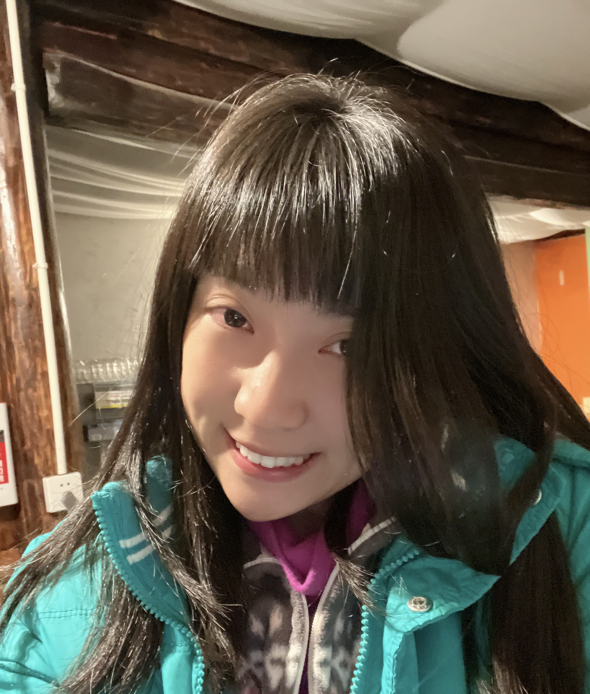
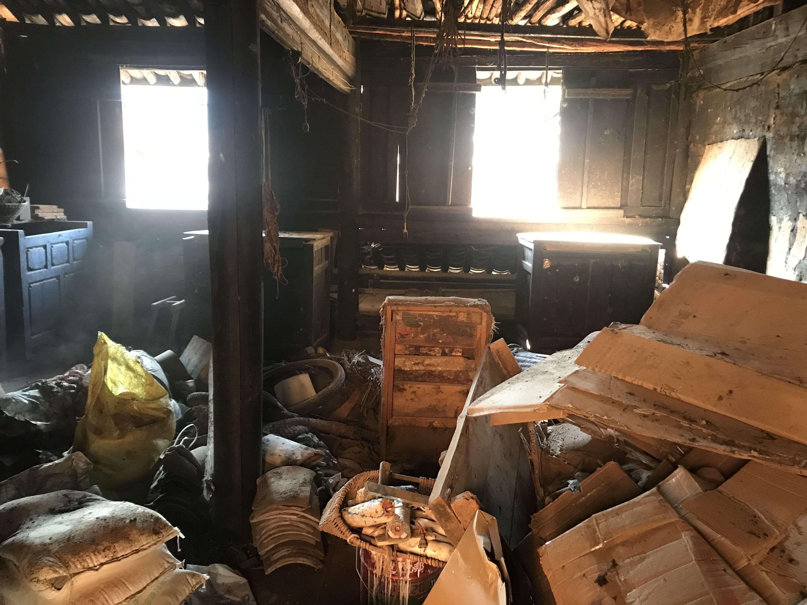
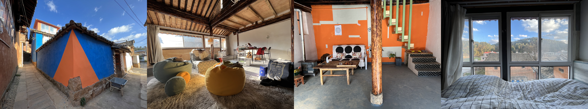
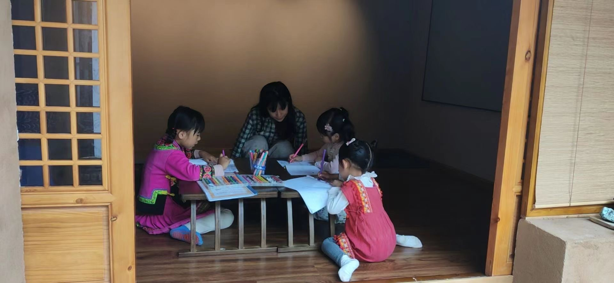
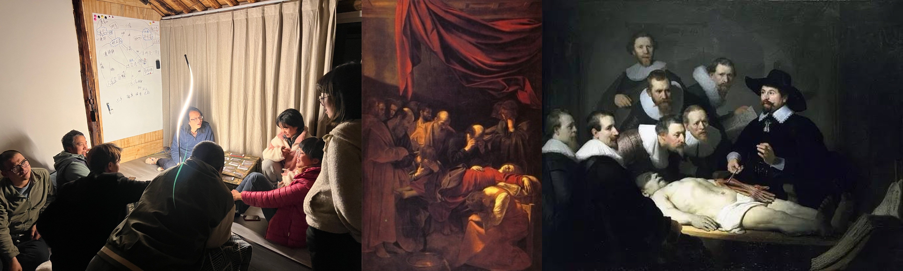

# Welcome to Khora's Org

Hi, this is me, Khora.

## 个人简介：
- 地域感很弱！在大连、上海、昆明、温哥华都有家，在北京、广东、英国居住过1年以上，但是非要自己一个人来西安（嘻嘻
- 艺术史->性别研究->计算机（是我的二硕）
- 吃货^w^
- 跳舞（各种舞种）
- 花粥/福禄寿/MAMAMOO/小女友(没错kpop人)/听到reggae节奏就想摇起来
- KTV经典曲目《套马杆》

My current life (before joining Thoughtworks):

我在昆明近郊的一个小山村以低价租了一栋彝族老宅并进行改造。

改造前是这样的：

改造后是这样的：

平日的生活：

-教村子里的小朋友英语和数学

-下山跳舞和演出（图为非洲舞，我们有一个非洲鼓舞队）

-去邻居家聚餐和玩剧本杀（村子里新老村民融合共处，老村民是彝族原住民，来自城市的新村民背景非常多元）

- 去镇上的艺术学校教舞蹈

